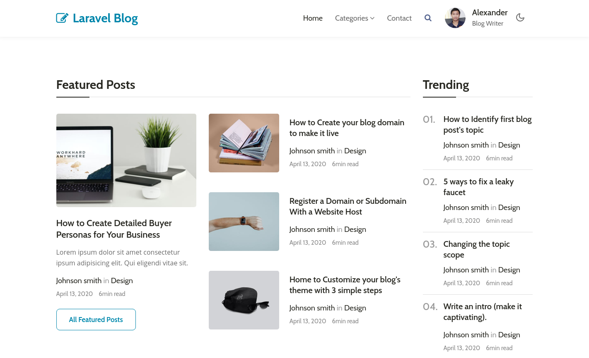

<p align="center"><a href="https://laravel.com" target="_blank"></a></p>

<p align="center">
<a href="https://travis-ci.org/laravel/framework"></a>
<a href="https://packagist.org/packages/laravel/framework"></a>
<a href="https://packagist.org/packages/laravel/framework"></a>
<a href="https://packagist.org/packages/laravel/framework"></a>
</p>

## Laravel 8 Jetstream KIT

Laravel 8 Jetstream KIT is a starter kit for build web application with most features in a modern standard web project.

This project build with:

- Laravel 8 Jetstream.
- Vuejs 2.
- Tailwindcss

## Features:

- [ ] Roles & Permissions management with Sanctum.
- [ ] API Authentication and Authorization with Sanctum.
- [ ] Realtime event broadcasting with Redis & Websocket (use Redis Docker).
- [ ] CRUD & Pagination template. (Vuejs)
- [ ] Subscription and Payment support (Stripe)
- [ ] Social login for Google, Facebook, Twitter, LinkedIn, GitHub, GitLab and Bitbucket (Laravel Socialite)
- [ ] Search Engine integrated with Algolia (simple enable in configure).
- [ ] Search Engine integrated with ElasticSearch (simple enable in configure).
- [ ] Background Job Processing.
- [ ] Support multiple Payment gateways (Stripe, Momo, ..).


## Screenshot



## Testing

In this project we Testing and codecoverage report with Xdebug.

- PHP 7.4.12
- PHPUnit 9.3.10
- php-code-coverage 9.1.8
- Xdebug 2.9.8

Easy install Xdebug on Ubuntu 18.04+

```shell
sudo apt-get install php-xdebug
```

Run testing

```shell
make test
```

## Softwares

### Elasticsearch

Start Elasticsearch and Kibana using Docker Compose:

```shell
docker-compose up -d
```

## Quickstart

Start Frontend development with yarn

```shell
yarn install
yarn watch
```

Start Laravel development

```shell
composer install
php artisan key:generate
php artisan serve
```

## Docs

Full Gudeline Documentaion

## Laravel Common CLI

```shell
# Dump the current database schema and prune all existing migrations (use --prune).
php artisan schema:dump
```


## Reference

- Elastic Search: https://www.elastic.co/guide/en/elasticsearch/reference/7.9/docker.html
- XDebug: https://xdebug.org/docs/install


## License

The Laravel framework is open-sourced software licensed under the [MIT license](https://opensource.org/licenses/MIT).
