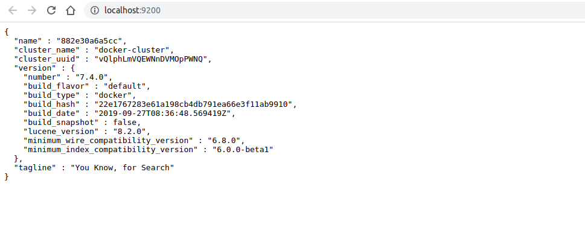
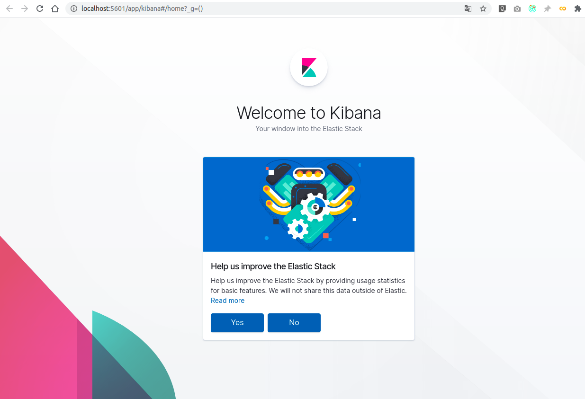

# Elasticsearch 7

In this project, we will start a simple Elasticsearch 7 single node cluster for local development with Docker compose.

To run the Elasticsearch 7 Docker image in development mode, we will set `discovery.type=single-node`.

At startup, the bootstrap checks are bypassed. The single node will elect itself as the master node and will not join a cluster with any other node.

Example `docker-compose.yml` file to run a single node Elasticsearch 7 Cluster including Kibana

```yml
version: '3.7'

services:

  # Elasticsearch Docker Images: https://www.docker.elastic.co/
  elasticsearch:
    image: docker.elastic.co/elasticsearch/elasticsearch:7.4.0
    container_name: elasticsearch
    environment:
      - xpack.security.enabled=false
      - discovery.type=single-node
    ulimits:
      memlock:
        soft: -1
        hard: -1
      nofile:
        soft: 65536
        hard: 65536
    cap_add:
      - IPC_LOCK
    volumes:
      - elasticsearch-data:/usr/share/elasticsearch/data
    ports:
      - 9200:9200
      - 9300:9300

  kibana:
    container_name: kibana
    image: docker.elastic.co/kibana/kibana:7.4.0
    environment:
      - ELASTICSEARCH_HOSTS=http://elasticsearch:9200
    ports:
      - 5601:5601
    depends_on:
      - elasticsearch

volumes:
  elasticsearch-data:
    driver: local
```

Start Elasticsearch and Kibana using Docker Compose:

```shell
docker-compose up -d
```

Elasticsearch node will startup now, and after a couple of seconds, we can reach it at http://localhost:9200. 



Kibana should be running at http://localhost:5601.




For more details about Elasticsearch 7 related to my blogpost check out:


- [Elasticsearch 7 Breaking Changes](https://www.elastic.co/guide/en/elasticsearch/reference/7.0/breaking-changes-7.0.html)
- [Elasticsearch 7 Cluster Bootstrap Checks](https://www.elastic.co/guide/en/elasticsearch/reference/7.0/modules-discovery-bootstrap-cluster.html)
- [Elasticsearch 7 Bootstrap Checks](https://www.elastic.co/guide/en/elasticsearch/reference/current/bootstrap-checks.html)
- [Official Elasticsearch 7 Docker Documentation](https://www.elastic.co/guide/en/elasticsearch/reference/current/docker.html)
- [Official Docker Image for Elasticsearch & Kibana](https://www.docker.elastic.co/)


